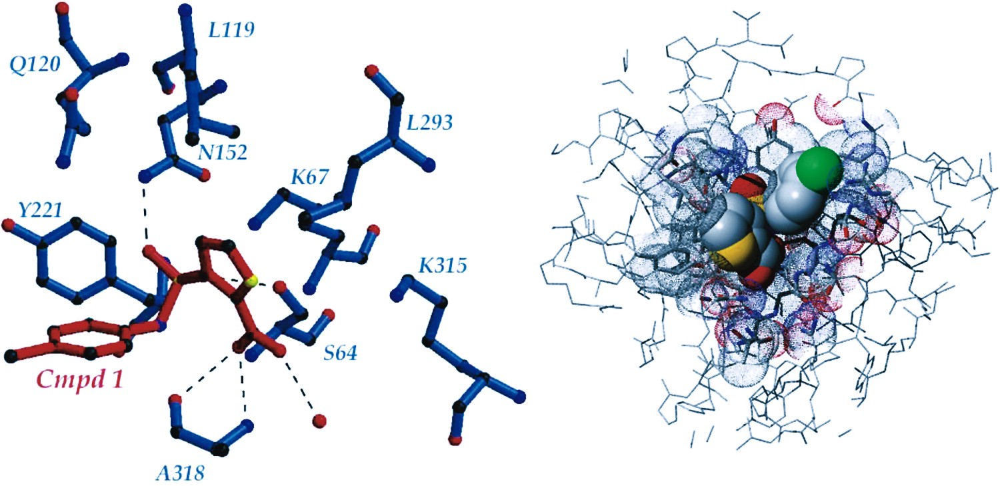
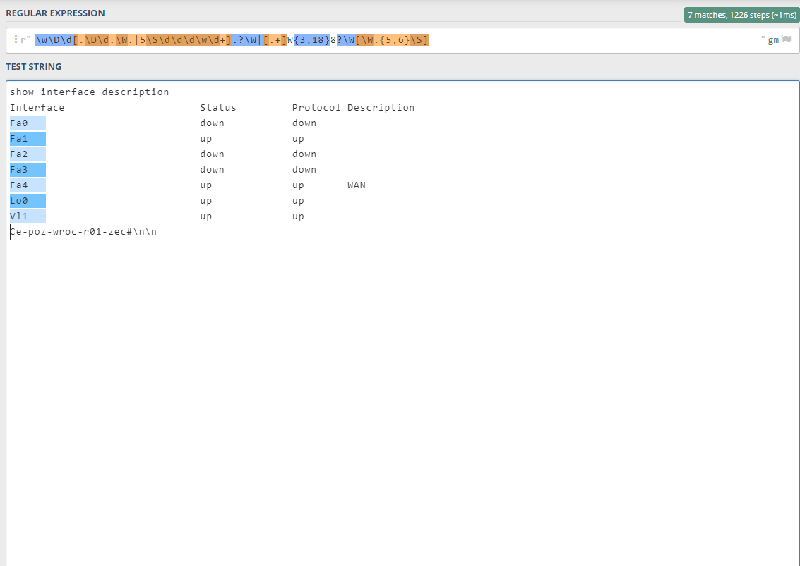

# Kramarzos Genetixo Regexator

Bored of writing regular expressions?
Boss wanted autnomus system that reads data from client emails and you have no idea what to do?
Or maybe you just like to waste your time.

We got you buddy. 

 

## Geneticaly Generated Regular Expressions

What are regular expressions?  
 
Yes

We use genetic algorithm to generate them.

But Krzysztof, what is genetic algorithm?

It works like nature, slow, but steady. 
It generates N random solutions and choose some best ones (parents).
These parents then freak. What happens when two people frak? They have kids which 
inherit random features of their parents. These kids will be treated as new population.  
Etc. 
 
It maximizes survival - in our case survival is equivalent of how good our regular expression is.
It can be pretty random and slow - but generates best possible solutions.
These solution can have some random stupid parts that does not make any sense. But that's how nature works. 
 

## USE CASES

My module can be used in 2 cases.  

1. Generate perfect regular expression that matches only good stuff. 

2. Generate imperfect regular expression that matches good stuff and some shit. 

### Example

We want to generate regular expression matching one column in ascii table. 
So we input the data and wait 5 minutes. Result is as follows:  

 

